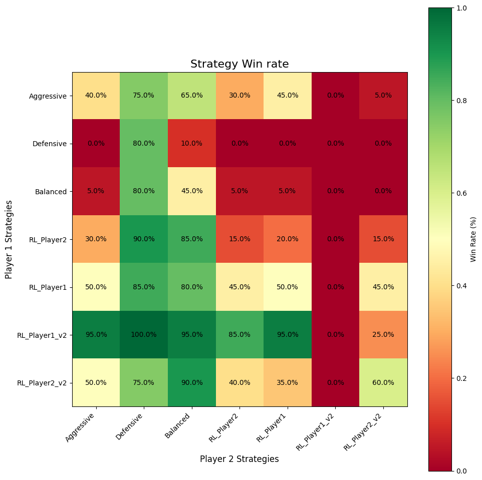
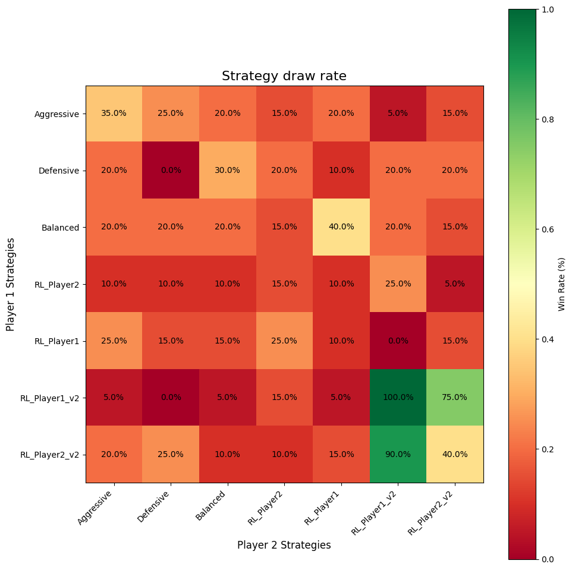
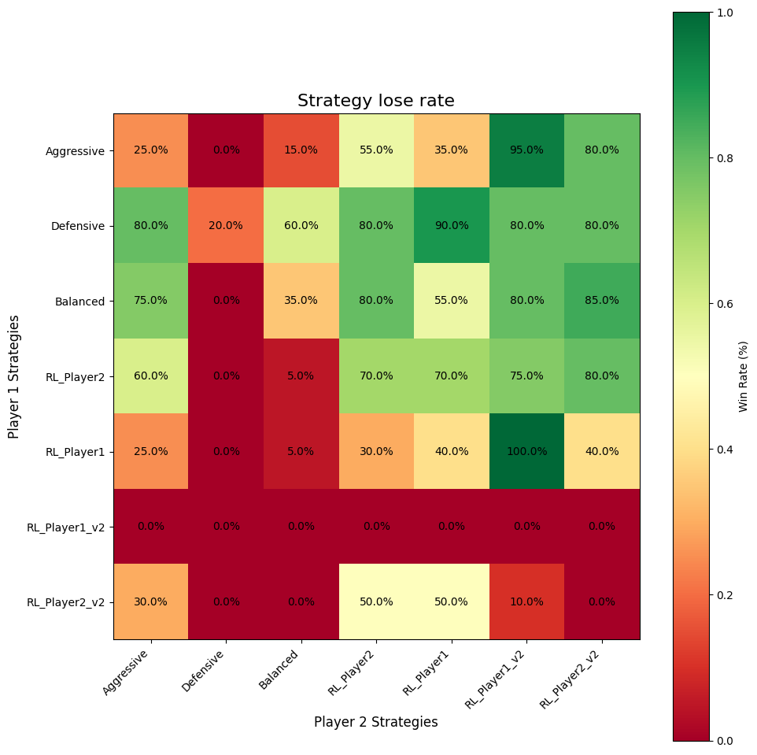

# Naval Battle Simulation

## Introduction

This project simulates a naval battle where two players control fleets of ships with varying attributes. The game includes a mix of predefined strategies and reinforcement learning (RL)-trained strategies, enabling players to explore tactical decisions and evaluate their effectiveness.

## Features

- **Dynamic Fleet Composition**: Each player controls ships of varying sizes, health, movement ranges, and missile capabilities.
- **Missile Mechanics**: Two missile types (`CROSS` and `SQUARE`) with distinct attack patterns and range effects.
- **Advanced Decision-Making**: Players evaluate actions based on weights for health, missile resources, blocking opportunities, targeting, and distance strategies.
- **Reinforcement Learning (RL)**: The game includes a Q-learning agent (`QAgent`) to train optimized strategy parameters.
- **Predefined Strategies**: Includes static strategies (Aggressive, Defensive, Balanced) and RL-trained dynamic strategies.

## Default Configuration

The game features the following default ship configurations:

### Player 1
- **2 Small Ships**: 
  - **Health**: 1
  - **Movement Range**: 2 tiles (square shape distance)
  - **Missiles**: 3 `SQUARE`
- **2 Medium Ships**:
  - **Health**: 2
  - **Movement Range**: 3 tiles
  - **Missiles**: 4 `CROSS`, 2 `SQUARE`
- **4 Large Ships**:
  - **Health**: 3
  - **Movement Range**: 4 tiles
  - **Missiles**: 5 `CROSS`, 4 `SQUARE`

### Player 2
- **3 Small Ships**:
  - Same as Player 1
- **3 Medium Ships**:
  - Same as Player 1
- **3 Large Ships**:
  - Same as Player 1

### Missile Mechanics
- **`CROSS` Missile**: Deals damage in a cross-shaped pattern around the target (up, down, left, right).
- **`SQUARE` Missile**: Deals damage in a 3x3 square grid around the target.

Missiles can be blocked by both friendly and enemy ships based on their alignment and proximity to the target. Blocking considers the perpendicular distance from the missile's path.

## Game Mechanics

1. **Ship Placement**: Both players place their ships on opposite sides of the map.
2. **Turn Sequence**:
   - Player 1 attacks.
   - Player 2 moves.
   - Player 1's attacks are triggered and resolved.
   - Player 2 attacks.
   - Player 1 moves.
   - Player 2's attacks are triggered and resolved.
3. **Decision Variables**:
   - **Health and Missile Weights**: Influence the perceived value of a ship.
   - **Block Weight**: Assigns a score for blocking enemy attacks for ally (also affect by their value).
   - **Target Weight**: Assigns a score for possilbe of been target by each enemy.
   - **Distance Weights**:
     - **Enemy Distance Weight**: Evaluates proximity to enemies.
     - **Ally Distance Weight**: Evaluates proximity to allies.
   - **Attack Threshold**: Determines the minimum score required to launch an attack.
4. **Behavior Simplifications**:
   - Ships are controlled sequentially by players.
   - Ships cannot predict each other's strategies.
   - Ships avoid friendly fire and maintain at least one tile distance from allies to prevent splash damage.
   - Ships do not prioritize missile types and instead use available resources as needed.

## Experiment Functions

### `runParameterExperiment`
- Trains RL agents using `QAgent` to optimize strategy parameters.
- Simulates thousands of games with varying strategies to identify the best-performing parameter set.

### `runDifferentStrategy`
- Conducts strategy comparisons using predefined parameters (e.g., Aggressive, Defensive, Balanced) alongside RL-trained strategies.
- Outputs win rates, remaining ship counts, and detailed performance metrics.
## Default Strategies and Parameters

The following predefined strategies are used in the `runDifferentStrategy` experiment:

### Strategy Configurations
Each strategy's parameters are listed in the following order:
`healthWeight`, `missileWeight`, `blockWeight`, `targetWeight`, `enemyDistanceWeight`, `allyDistanceWeight`, `attackThreshold`.
1. **Aggressive**: initial default strategy Focuses on offense with lower blocking and targeting priorities.  
   Parameters: `-1.0, 1.0, 0.8, -0.5, 0.5, -0.5, 0`
2. **Defensive**: Initial default strategy prioritizes blocking and targeting while maintaining a cautious attack threshold.  
   Parameters: `-1.0, 1.0, 1.2, -1.5, 0.5, -0.5, 2`
3. **Balanced**: Initial default strategy, middle-ground approach between offense and defense.  
   Parameters: `-1.0, 1.0, 1.0, -1.0, 0.5, -0.5, 1`
4. **RL_Player2**: RL-trained strategy with optimized parameters for Player 2.
    Parameters: `-1.583, 1.054, 1.130, -1.348, -0.641, -0.301, 0.108`
5. **RL_Player1**: RL-trained strategy with optimized parameters for Player 1.
    Parameters: `-0.955, 0.655, 0.288, -1.263, 0.074, -0.530, -0.175`
6. **RL_Player1_v2**: RL-trained strategy with optimized parameters for Player 1 (version 2).
    Parameters: `-1.896, -1.594, 0.790, 1.110, 0.478, 1.598, 1.772`
7. **RL_Player2_v2**: RL-trained strategy with optimized parameters for Player 2 (version 2).
    Parameters: `-1.685, 0.782, 0.741, -1.793, -0.753, -0.492, 0.482`

### Results 
20 game are played for each strategy pair, and the results are summarized in the following figures:
- **Win Rate**: 

- **Draw Rate**:

- **Lose Rate**:


## Observations from Strategy Experiments

1. RL strategies significantly outperform predefined strategies in most cases. especially RL_Player1_v2, never lose to any other strategy while playing as Player 1.
2. RL_Player2_V2 successfully make most of the game draw while fighting to RL_Player1_v2, which sims to be the best strategy.
3. According to the overall strategy analysis(from Strategy.txt) ,RL_Player1_v2 successfully keep all the ships alive in 20 games
4. According to the overall strategy analysis,in predefined strategy ,aggressive strategy is better than balanced strategy, and balanced strategy is better than defensive strategy.

## Strategy Analysis

### 1. RL_Player1_v2's Superior Performance Analysis
Parameters: `-1.896, -1.594, 0.790, 1.110, 0.478, 1.598, 1.772`

#### Key Success Factors
1. **Optimal Resource Management**
    - High attack threshold (1.772) ensures high-quality attacks
    - Negative missile weight (-1.594) indicates aggressive resource conversion
    - Results: 70.7% win rate as Player 1, highest ships remaining (8.0)

2. **Strategic Position Control**
    - High ally distance weight (1.598) enables effective formation control
    - Positive target weight (1.110) ensures precise target selection
    - Outcome: Highest average health remaining (18.0)

### 2. RL_Player2_v2's Effective Counter Strategy
Parameters: `-1.685, 0.782, 0.741, -1.793, -0.753, -0.492, 0.482`

#### Defensive Adaptation
1. **Resource Conservation**
    - Positive missile weight (0.782) prioritizes resource preservation
    - Lower attack threshold (0.482) enables counter-attack opportunities
    - Result: 52.1% win rate as Player 2

2. **Position Flexibility**
    - Negative enemy distance (-0.753) and ally distance (-0.492) weights
    - Supports unpredictable movement patterns
    - Outcome: High survival rate (8.8 ships remaining)

### 3. Predefined vs. RL Strategy Gap Analysis

#### RL Advantages
1. **Parameter Optimization**
    - RL strategies utilize extreme values (e.g., -1.896, 1.598)
    - Predefined strategies limited to conservative ranges (-1.0 to 1.0)

2. **Situational Adaptation**
    - RL learned optimal parameter combinations
    - Predefined strategies follow fixed patterns
    - Evidence: RL strategies average 60%+ win rates vs. 30-40% for predefined

### 4. Predefined Strategy Hierarchy
Aggressive > Balanced > Defensive

#### Performance Analysis
1. **Aggressive Strategy Success**
    - Lower attack threshold (0) enables more attack opportunities
    - Win rates: 37.1% (P1) and 42.1% (P2)

2. **Defensive Strategy Limitations**
    - High attack threshold (2) reduces attack frequency
    - Poor win rates: 12.9% (P1) and 2.9% (P2)

3. **Balanced Strategy Mediocrity**
    - Middle-ground parameters prove suboptimal
    - Moderate win rates: 20.0% (P1) and 17.1% (P2)

### 5. Player Position Impact Analysis

#### Player 1 Optimal Characteristics
1. **Aggressive Strategies Excel**
    - First-mover advantage suits aggressive play
    - RL_Player1_v2: 70.7% win rate
    - Higher average health remaining (18.0)

2. **Resource Utilization**
    - Early game control crucial
    - Aggressive strategies maintain higher ship count

#### Player 2 Optimal Characteristics
1. **Adaptive Strategies Perform Better**
    - RL_Player2 achieves 52.1% win rate
    - Higher average ships remaining (8.6-9.0)

2. **Defensive Capabilities**
    - Successful counter-strategies maintain higher health
    - More consistent performance across different opponents

## Possible Strategies design direction

1. **Strategy Evolution**
    - RL strategies demonstrate superior adaptability
    - Extreme parameter combinations prove more effective
    - Position-specific optimization crucial for success

2. **Position Impact**
    - Player 1 benefits from aggressive, first-mover strategies
    - Player 2 requires flexible, counter-attack focused approaches

3. **Resource Management**
    - Optimal resource utilization distinguishes RL from predefined strategies
    - Balance between conservation and aggression key to success
## Limitations 
This simulation has several limitation because of the complexity and hard to precisely evaluate every stage.
## How to Run

1. **Compile the code**:
   ```bash
   g++ -std=c++20 -o naval_simulation main.cpp
   ```
2. **Execute the program**:
   ```bash
   ./naval_simulation
   ```
   By default, the program runs the predefined strategy comparison (`runDifferentStrategy`). To enable RL training, uncomment the `runParameterExperiment()` function in the `main()` function.

## Outputs
The program also outputs detailed game logs, including:
- Training updates for RL agents and strategy evaluations.
- Win rates and performance summaries.

Set **VERBOSE_OUTPUT = true** to enable detail game information at each game stage 
- attack and move choice select by player 
- ship status at each stage


## Dependencies

This project only requires the C++ Standard Library, including:
- `<vector>`, `<cmath>`, `<algorithm>`, `<random>`, `<iostream>`, and others.

